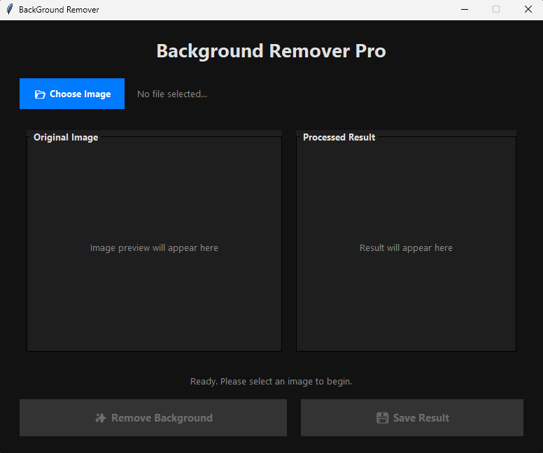
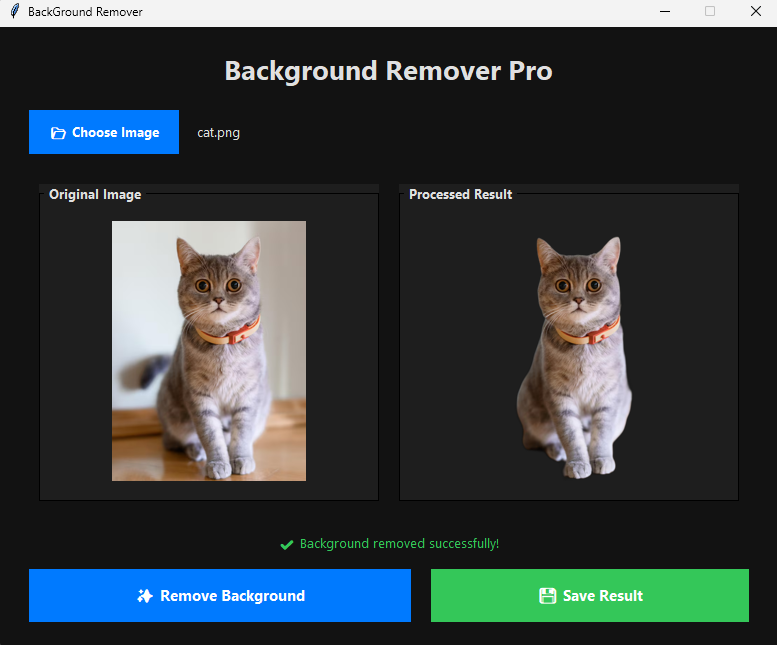

# Image Background Remover

A modern desktop application for removing image backgrounds using Python.

## Features

- Modern Tkinter interface
- Image preview
- Background removal using AI
- Save transparent PNG
- Multithreaded processing
- Simple and easy to use

---

## Screenshots

### Home



### Result



---

## Installation

Clone the repository

```bash
git clone https://github.com/nouman-zaib/image-background-remover.git
```

Go to project folder

```bash
cd image-background-remover
```

Install dependencies

```bash
pip install -r requirements.txt
```

Run the application

```bash
python main.py
```

---

## Technologies

- Python
- Tkinter
- Pillow
- rembg
- ONNX Runtime

---

## Project Structure

```
image-background-remover
│
├── main.py
├── requirements.txt
├── README.md
├── screenshots
└── LICENSE
```

---

## Future Improvements

- Drag & Drop support
- Batch background removal
- Dark / Light themes
- Image resize options
- Export to JPG and WEBP

---

## License

MIT License